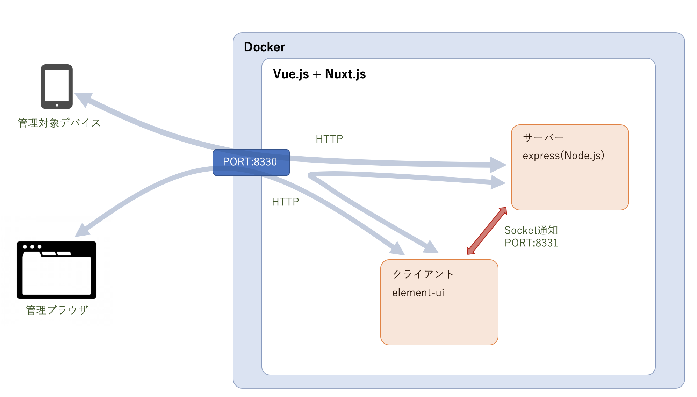
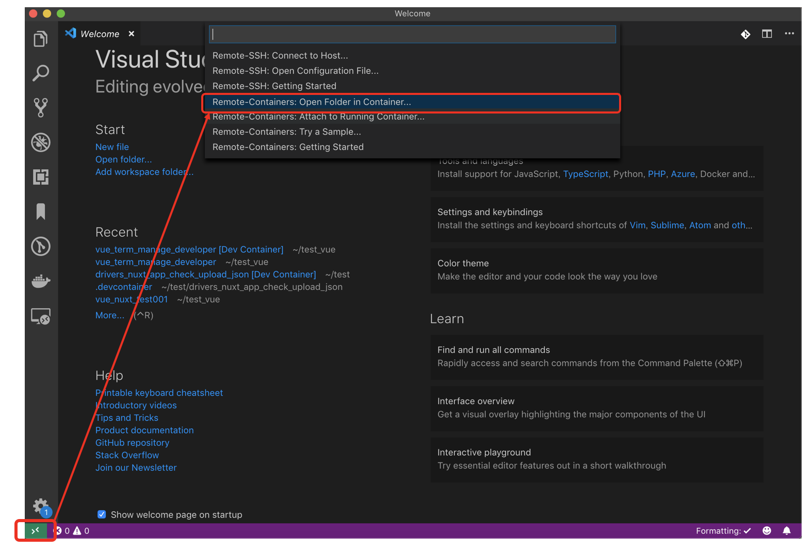
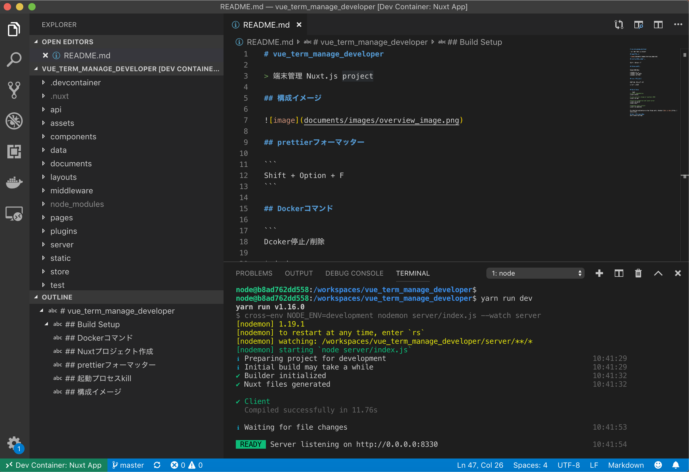

# vue_term_manage_developer

> 端末管理 Nuxt.js project

## 構成イメージ



## VS CodeでDocker環境にRemote接続



## Nuxtアプリ起動

```
terminal windowでコマンド実行

$yarn install .... yarn インストール
$yarn run dev .... アプリ起動
```



## prettierフォーマッター

```
Shift + Option + F
```

## Dockerコマンド

```
Dcoker停止/削除

$ docker ps -a
$ docker stop <PID>
$ docker rm <PID>
```

## 起動プロセスkill

```
PORTからプロセスを特定

$ lsof -i:8330
```


## Build Setup

``` bash
# install dependencies
$ yarn install

# serve with hot reload at localhost:3000
$ yarn run dev

# build for production and launch server
$ yarn run build
$ yarn start

# generate static project
$ yarn run generate
```

For detailed explanation on how things work, checkout [Nuxt.js docs](https://nuxtjs.org).

## Nuxtプロジェクト作成
yarn create nuxt-app .
